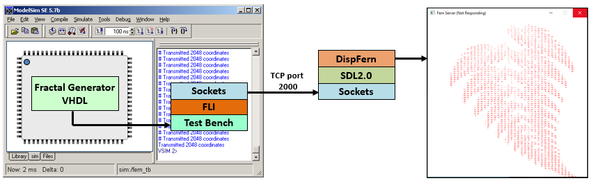
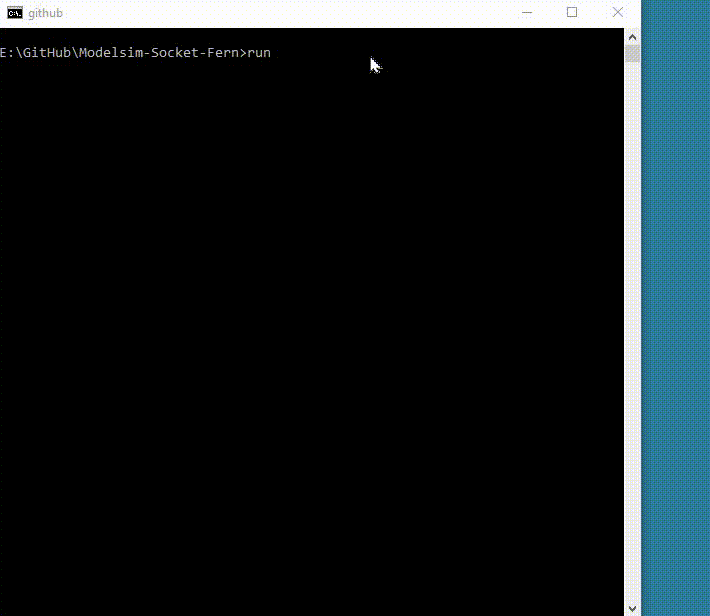

# Modelsim-Socket-Fern

This demo shows a VHDL design generating graphical Fern coordinates which are then send via a socket implemented using the **Foreign Language Interface** (FLI) to a graphical display program.



The display program is based on the **SDL2.0** library and for the sockets the standard Windows **lwsock32** library is used. To simplify running the demo the generated **DLL** files are all supplied but from a security point of view it is **highly recommended** you compile your own DLL files, the same applies to the ferndisp/ferndisp.exe program.


## Requirements
1) 64bits Modelsim DE (or Questa), Modelsim PE users need to install 64bits Modelsim DE *(works on a PE license)*
2) 64bits gcc-7.4.0-mingw64vc15 as supplied with Modelsim 2022.1 *(other versions will work as well)*
3) [Simple DirectMedia Layer](https://www.libsdl.org/) SDL2.0.14 library for Windows

## Check before building
1) Make sure the Modelsim installation root directory is set via the **MTI_HOME** environmental variable. This is required because the **run.bat** file uses %MTI_HOME%/include and %MTI_HOME%/win64pe.
```
E:\Modelsim-Socket-Fern>echo %MTI_HOME%
D:\Products\modelsim_de_2022
```

2) Make sure the Modelsim gcc bin directory (*<modelsim_install_directory>\gcc-7.4.0-mingw64vc15\bin*) is in the search path.
```
E:\Modelsim-Socket-Fern>gcc --version
gcc (GCC) 7.4.0
Copyright (C) 2017 Free Software Foundation, Inc.
This is free software; see the source for copying conditions.  There is NO
warranty; not even for MERCHANTABILITY or FITNESS FOR A PARTICULAR PURPOSE.
```

## How does it work

The Fern generator generates new coordinates every clock cycle after reset. These coordinates are then read by a **foreign architecture** FLI implementation. The Foreign Architecture means the FLI code *(src/fli_fern.c)* creates an architecture with I/O ports and sensitivity list from C, effectively it build the architecture during elaboration. 

```VHDL
entity fern_tester is
   port( 
      x     : in     std_logic_vector (15 downto 0);
      y     : in     std_logic_vector (15 downto 0);
      clk   : in     std_logic;
      reset : in     std_logic);
end fern_tester;

architecture rtl of fern_tester is

attribute foreign : string;
attribute foreign of rtl: architecture is "cif_init ./fli_fern.dll";

begin
    -- Process created from C
end rtl;
```

The FLI code to build the foreign process is nearly always the same and consist of the following 4 steps:

1) Malloc some memory for the used ports

```C
ip = (inst_rec *)mti_Malloc(sizeof(inst_rec));     // allocate memory for ports
```

2) Get some pointer to the VHDL ports so that we can read and drive them

```C
ip->clk = mti_FindPort(ports, "clk");              // Get entity ports
```

3) Create a process

```C
proc = mti_CreateProcess("fern_tester", fern_tester, ip); // Create Process
```

4) And finally set the sensitivity signals

```C
mti_Sensitize(proc, ip->clk, MTI_EVENT);           // Add sensitivity signals
```

During step 3 we created a process and supplied the name of the C function that implements it *(fern_tester)*. During simulation whenever there is an event on the **clk** signal the fern_tester process (function) is called. The fern_tester process looks something like:

```C
static void fern_tester(void *param)                // C version of vhdl_fern process
{
    inst_rec * ip = (inst_rec *)param;
    if (mti_GetSignalValue(ip->clk)==STD_LOGIC_1) { // Check we have a rising edge
        if (mti_GetSignalValue(ip->reset)==STD_LOGIC_0) { // Check reset negated
            // Send Fern coordinates..
        }           
    }
}
```

That' all there is to it. You will find that most of the FLI examples in the manual use exactly the same procedure. In this example we simply transmit on every clock cycle, however, the FLI has 2 very useful socket functions which are not used in this example which are:

* mti_AddSocketInputReadyCB()
* mti_AddSocketOutputReadyCB()

These are non-blocking functions which are called/triggered whenever socket data is available for reading or writing. This means that socket communication can be used without constantly having to poll the socket and hence will allow faster more efficient simulation.


## Build FLI DLL and run the demo
To build the FLI DLL and run the simulation open a CMD prompt and execute **run.bat**. This should produce **fli_fern.dll** and then gives the output as shown below:




## License

See the LICENSE file for details.

## Notice
ModelSim®, Questa, QuestaSim and their respective logos are trademarks or registered trademarks of Siemens Industry Software Limited.